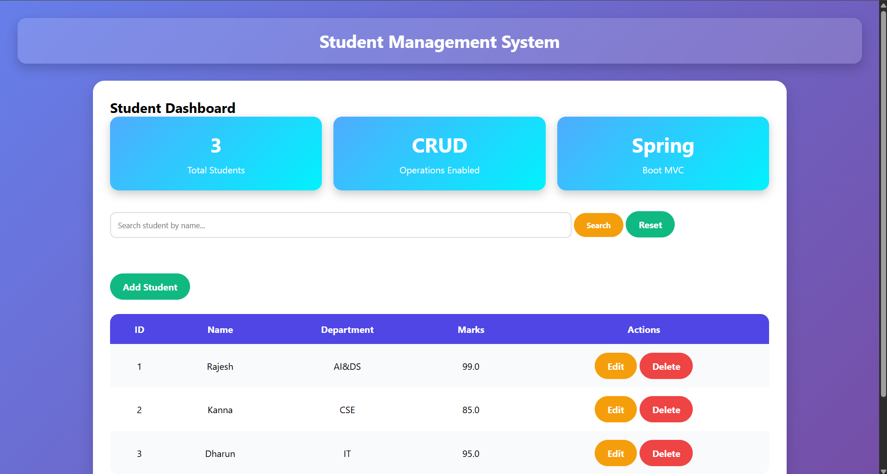
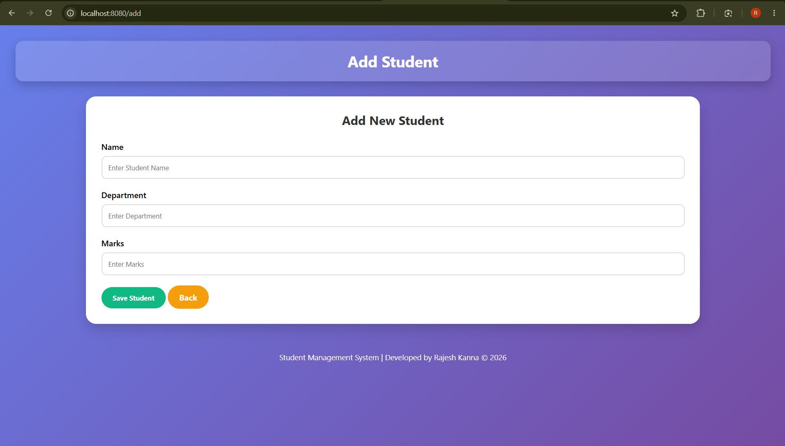
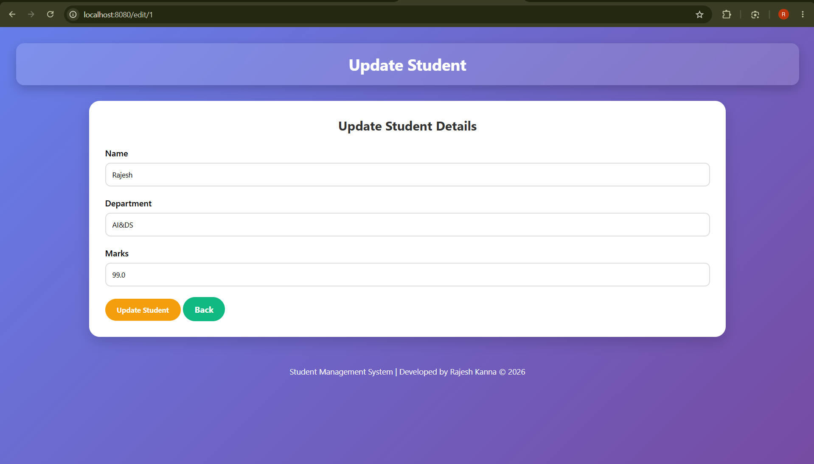
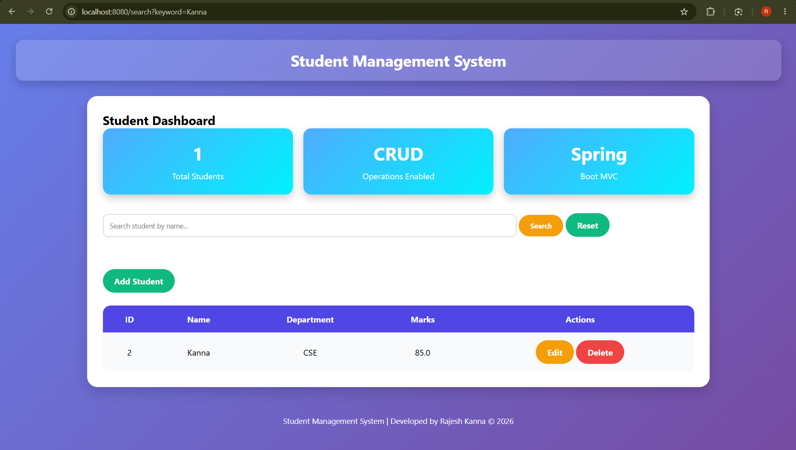

# 🎓 Student Management System

A web-based Student Management System developed using **Spring Boot MVC**, **Spring Data JPA**, **Thymeleaf**, and **MySQL**. This application allows users to perform CRUD operations on student records through a modern and user-friendly interface.

---

## 🚀 Features

* ➕ Add New Student
* 📋 View All Students
* ✏️ Update Student Details
* 🗑️ Delete Student Records
* 🔍 Search Students by Name
* 🎨 Modern Responsive UI
* 📊 Student Dashboard
* 🗄️ MySQL Database Integration

---

## 🛠️ Tech Stack

### Backend

* Java 17
* Spring Boot 3
* Spring MVC
* Spring Data JPA
* Hibernate

### Frontend

* Thymeleaf
* HTML5
* CSS3

### Database

* MySQL

### Build Tool

* Maven

### Version Control

* Git & GitHub

---

## 📂 Project Structure

```text
src/main/java
│
├── controller
│   └── StudentController.java
│
├── model
│   └── Student.java
│
├── repository
│   └── StudentRepository.java
│
├── service
│   └── StudentService.java
│
└── StudentApplication.java

src/main/resources
│
├── static
│   └── css
│       └── style.css
│
├── templates
│   ├── index.html
│   ├── addStudent.html
│   └── updateStudent.html
│
└── application.properties
```

---

## 📸 Screenshots

### Dashboard



### Add Student



### Update Student



### Search Student



---

## ⚙️ Database Configuration

Create a MySQL database:

```sql
CREATE DATABASE studentdb;
```

Update the `application.properties` file:

```properties
spring.datasource.url=jdbc:mysql://localhost:3306/studentdb
spring.datasource.username=root
spring.datasource.password=your_password

spring.jpa.hibernate.ddl-auto=update
spring.jpa.show-sql=true
```

---

## ▶️ How to Run

### Clone Repository

```bash
git clone https://github.com/Rajesh-Kanna-K-2506/StudentManagement-SpringBoot.git
```

### Navigate to Project Folder

```bash
cd StudentManagement-SpringBoot
```

### Run Application

```bash
mvn spring-boot:run
```

### Open Browser

```text
http://localhost:8080
```

---

## 🔮 Future Enhancements

* Pagination
* Student Statistics Dashboard
* Export to Excel/PDF
* Login & Authentication
* REST API Support

---

## 👨‍💻 Author

**Rajesh Kanna K**

GitHub:
https://github.com/Rajesh-Kanna-K-2506

---

## ⭐ Support

If you found this project useful, consider giving this repository a **Star ⭐** on GitHub.
